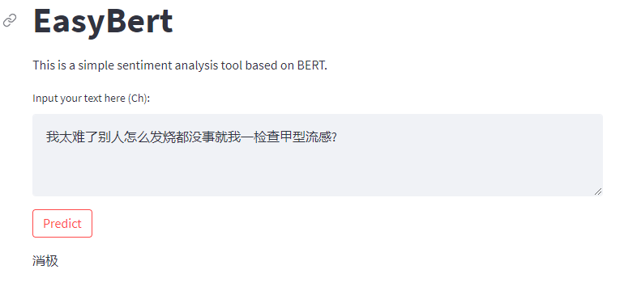
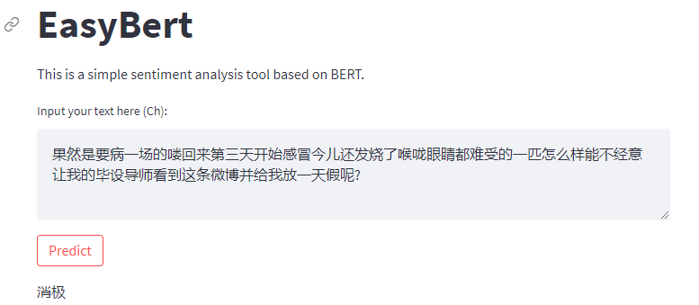
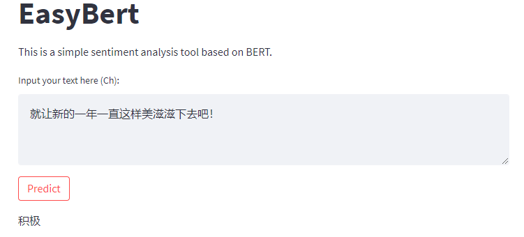
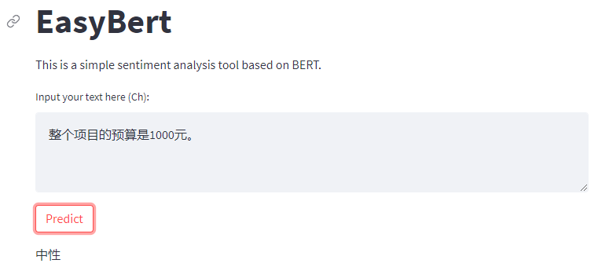

# BERT-sentiment-analysis

基于 BERT 的情感分析案例。

## 1. 项目背景

情感分析是自然语言处理中的一个重要任务，它的目标是识别出文本中的情感色彩，通常分为积极、消极、中性三种情感。情感分析在很多领域都有应用，比如舆情分析、产品评论分析等。本案例使用 BERT 模型进行情感分析。

## 2. 数据集

本案例使用了 THUCNews 数据集，THUCNews 是根据新浪新闻 RSS 订阅频道 2005~2011 年间的历史数据筛选过滤生成，包含 74 万篇新闻文档（2.19 GB），均为 UTF-8 纯文本格式。我们在原始新浪新闻分类体系的基础上，重新整合划分出 14 个候选分类类别：财经、彩票、房产、股票、家居、教育、科技、社会、时尚、时政、体育、星座、游戏、娱乐。 本案例使用其中的财经、科技、体育、娱乐四个类别的新闻文本，每个类别有 50000 条数据，共 200000 条数据。我们将这些数据按照 8:1:1 的比例划分为训练集、验证集和测试集，用于训练和评估模型的性能。 数据集的格式如下：

```
label	text
0	财经	新华社北京月日电记者李延霞
1	科技	新华社北京月日电记者李延霞
2	体育	新华社北京月日电记者李延霞
3	娱乐	新华社北京月日电记者李延霞
```

## 3. 模型

本案例使用了 BERT 模型进行情感分析。BERT 是 Google 在 2018 年提出的预训练模型，它在多个自然语言处理任务上取得了最先进的效果。BERT 模型的预训练过程是在大规模文本语料上进行的，因此可以学习到丰富的语言知识，可以很好地适应各种自然语言处理任务。

## 4. 实验环境

- Python 3.7
- PyTorch 1.9.0
- Transformers 4.9.2
- Streamlit

## 5. 运行方式

使用前需下载相应的已训练模型（pytorch_model.bin 和 bert.ckpt 这两个大文件），并导入相应位置：

模型下载地址：链接：https://pan.baidu.com/s/1fyENks6pJ3rreHPCRBzpKQ 提取码：qotk

在终端中执行以下命令：

```bash
streamlit run app.py
```

然后在浏览器中打开 http://localhost:8501 ，即可看到情感分析的界面。

## 6. 实验结果

本案例使用 BERT 模型在 IMDB 数据集上进行情感分析，最终在测试集上的准确率为 0.91。






## 7. 项目结构

```
- data: 存放数据集
- model: 存放训练好的模型
- app.py: Streamlit应用程序
- train.py: 训练模型
- predict.py: 预测
- utils.py: 工具函数
```

## 8. 参考

- [BERT: Pre-training of Deep Bidirectional Transformers for Language Understanding](https://arxiv.org/abs/1810.04805)
